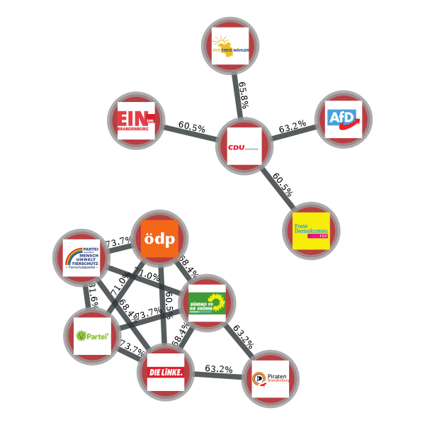
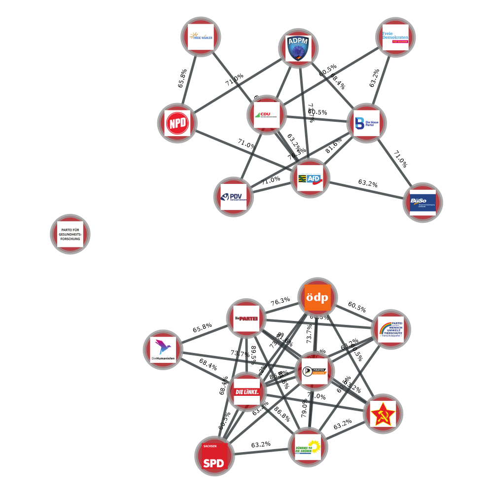

# Analysis of wahlomat-datasets for different elections in Germany

Elections are the foundation of modern democracies, but also bring some interesting dynamics with them. 
To bring the positions of the parties to light, the [federal agency of political education](https://www.bpb.de/) runs the
[wahl-o-mat](https://www.wahl-o-mat.de/), where answers of the participant are compared to the answers of the parties to show the overlap and give hints which party may support the participants positions most.

Here we compare the answers of each party to the answers of the other parties and evalueate their overlap to find clusters of parties with the same set of positions. 
For a decent visualization the [graph-tool](https://graph-tool.skewed.de/) package is used.

example 1: Here is the output of the sfpd-layout-algorithm with the overlap as spring-constants for the brandenburg election, the percentages on edges show the ratio of identical answers (Overlap below 60% not shown):  
  
example 2: Here is the output of the sfpd-layout-algorithm with the overlap as spring-constants for the sachsen election, the percentages on edges show the ratio of identical answers  (Overlap below 60% not shown):  
  

sources (starting with the most recent elections):   
Sachsen-Election 2019: http://www.wahl-o-mat.de/sachsen2019/PositionsvergleichSachsen2019.pdf  
Brandenburg-Election 2019: http://www.wahl-o-mat.de/brandenburg2019/Positionsvergleich-Brandenburg2019.pdf  
Bremen-Election 2019: https://www.wahl-o-mat.de/bremen2019/PositionsvergleichBremen2019.pdf  
European Parliament Election 2019: https://www.wahl-o-mat.de/europawahl2019/PositionsvergleichEuropawahl2019.pdf    

If the Jupyter-notebook is not shown in github, please visit:   
for the saxony-election 2019:  
https://nbviewer.jupyter.org/github/Yannoik/wahlo_analysis/blob/master/wahlomat_sachsen_19.ipynb    
for the brandenburg-election 2019:  
https://nbviewer.jupyter.org/github/Yannoik/wahlo_analysis/blob/master/wahlomat_brandenburg_19.ipynb   
for the (old) bremen-election 2019:  
https://nbviewer.jupyter.org/github/Yannoik/wahlo_analysis/blob/master/wahlomat_legacy.ipynb   
for the EU-election:  
https://nbviewer.jupyter.org/github/Yannoik/wahlo_analysis/blob/master/wahlomat_EU_19.ipynb  
